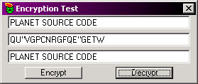

<div align="center">

## Beginner String Encryption


</div>

### Description

It takes a string from a textbox and encrypts it. Nothing major, i wouldnt use this for anything important, but i use it to encrypt data and put the encrypted string in the registry. This is sections of different codes i have found, i changed some of it around, joined some of it and found a nice little encryption method.
 
### More Info
 
An UnEncrypted String.

Not for governmental use. & You need at least 3 characters to encrypt the string.

An Encrypted String.

Coding may cause damage to personal life if not accompanied with Jolt Cola.


<span>             |<span>
---                |---
**Submitted On**   |
**By**             |[The Joker](https://github.com/Planet-Source-Code/PSCIndex/blob/master/ByAuthor/the-joker.md)
**Level**          |Beginner
**User Rating**    |4.2 (21 globes from 5 users)
**Compatibility**  |VB 5\.0, VB 6\.0
**Category**       |[Encryption](https://github.com/Planet-Source-Code/PSCIndex/blob/master/ByCategory/encryption__1-48.md)
**World**          |[Visual Basic](https://github.com/Planet-Source-Code/PSCIndex/blob/master/ByWorld/visual-basic.md)
**Archive File**   |[](https://github.com/Planet-Source-Code/the-joker-beginner-string-encryption__1-13836/archive/master.zip)


### Source Code

```
' [: Paste This Code Into a module. :]
Option Explicit
Dim DataLength as Boolean
Dim i As Integer
Dim Letter As String, Side0 As String, Side1 As String, Side2 As String
Public Function Encrypt(ByVal EncryptData As String)
 If Len(EncryptData) Mod 2 = 0 Then
  Side1 = StrReverse(Left(EncryptData, (Len(EncryptData) / 2)))
  Side2 = StrReverse(Right(EncryptData, (Len(EncryptData) / 2)))
  EncryptData = Side1 & Side2
 Else
  Side0 = StrReverse(EncryptData)
   For i = 1 To Len(Side0)
    Letter = Mid$(Side0, i, 1)
    Mid$(Side0, i, 1) = Chr(Asc(Letter) + 9)
   Next i
  EncryptData = Side0
 End If
 For i = 1 To Len(EncryptData)
  Letter = Mid$(EncryptData, i, 1)
  Mid$(EncryptData, i, 1) = Chr(Asc(Letter) + 2)
 Next i
 Encrypt = EncryptData 'LCase(EncryptData)
End Function
Public Function Decrypt(ByVal DecryptData As String)
 For i = 1 To Len(DecryptData)
  Letter = Mid$(DecryptData, i, 1)
  Mid$(DecryptData, i, 1) = Chr(Asc(Letter) - 2)
 Next i
 If Len(DecryptData) Mod 2 = 0 Then
  Side1 = StrReverse(Left(DecryptData, (Len(DecryptData) / 2)))
  Side2 = StrReverse(Right(DecryptData, (Len(DecryptData) / 2)))
  DecryptData = Side1 & Side2
 Else
  Side0 = StrReverse(DecryptData)
   For i = 1 To Len(Side0)
    Letter = Mid$(Side0, i, 1)
    Mid$(Side0, i, 1) = Chr(Asc(Letter) - 9)
   Next i
  DecryptData = Side0
 End If
 Decrypt = DecryptData 'LCase(DecryptData)
End Function
' [: ENCRYPTDATA & DECRYPTDATA 2 B PASSED :]
Private Sub Command1_Click()
Dim EncryptData As String
CheckLength
If DataLength = True Then
 EncryptData = EncryptData & Encrypt(Text1.Text)
 Text2.Text = EncryptData
Else
 MsgBox "Sorry, Not Enuogh Characters"
End If
End Sub
'-=-=-=-=-=-=-=-=-=-=-=-=-=-=-=-=-=-
Private Sub Command2_Click()
Dim DecryptData As String, DecryptRegData As String
 DecryptData = DecryptData & Decrypt(Text2.Text) '(DecryptRegData)
 Text3.Text = DecryptData
End Sub
'-=-=-=-=-=-=-=-=-=-=-=-=-=-=-=-=-=-
Sub CheckLength()
 If Len(Text1.Text) <= 3 Then
  DataLength = False
 Else
  DataLength = True
 End If
End Sub
'-=-=-=-=-=-=-=-=-=-=-=-=-=-=-=-=-=-
Private Sub Form_Load()
 DataLength = False
End Sub
```

